# Architecture

Three levels of zoom, then a call graph generated from the code.

## Snapshot

The tree was being edited while this was written. Every line number below refers
to this snapshot:

| File | Lines | mtime | SHA-256 (first 12) |
|---|---|---|---|
| `cap.py` | 5 459 | 19/08 21:28:41 | `D475A0ACD86E` |
| `mosaic.py` | 993 | 19/08 20:46:10 | `6C0F94DBC9B5` |
| `guidance.py` | 501 | 15/08 16:51:16 | `5617DF0931AE` |
| `receiver.py` | 401 | 19/08 21:14:49 | `EA56F23EFB21` |
| `try_mosaic.py` | 375 | 19/08 21:25:29 | `843B853542BE` |
| `eyevu_mosaic/config.py` | 334 | 19/08 20:10:55 | `E74C2FEADB12` |
| `eyevu_mosaic/run_session.py` | 369 | 19/08 21:22:12 | `467AA8BA60A7` |
| `eyevu_mosaic/synth.py` | 341 | 19/08 21:35:37 | `B9D906D1F496` |
| `eyevu_mosaic/core/preprocess.py` | 293 | 19/08 19:17:34 | `4194687614EA` |
| `eyevu_mosaic/core/features.py` | 156 | 19/08 21:11:35 | `5E1CF83E7AA5` |
| `eyevu_mosaic/core/pairwise.py` | 646 | 19/08 21:11:35 | `56B4B352A42B` |
| `eyevu_mosaic/core/graph.py` | 230 | 19/08 18:18:49 | `5D9416E1E8DA` |
| `eyevu_mosaic/core/globalopt.py` | 512 | 19/08 20:29:03 | `E03598B89C62` |
| `eyevu_mosaic/core/compose.py` | 338 | 19/08 20:09:55 | `E38AA7BE5A30` |
| `eyevu_mosaic/core/models.py` | 321 | 19/08 17:58:53 | `D061BC045765` |
| `eyevu_mosaic/core/bundle.py` | 302 | 19/08 21:21:58 | `4122733A6401` |

`features.py` and `pairwise.py` at 21:11:35 are the dead-code commenting from
[REPO_MAP.md §5.1](REPO_MAP.md). `cap.py`, `run_session.py`, `bundle.py`,
`synth.py` were changed by you after that, adding the patient tier — which is
included below.

All sizes quoted are **measured from this working copy**, not estimated.

---

# Level 1 — system

11 nodes. Solid arrows carry image data; dashed arrows carry only geometry or
metadata. Sizes are medians measured over the 142 extracts and 6 bundles present.

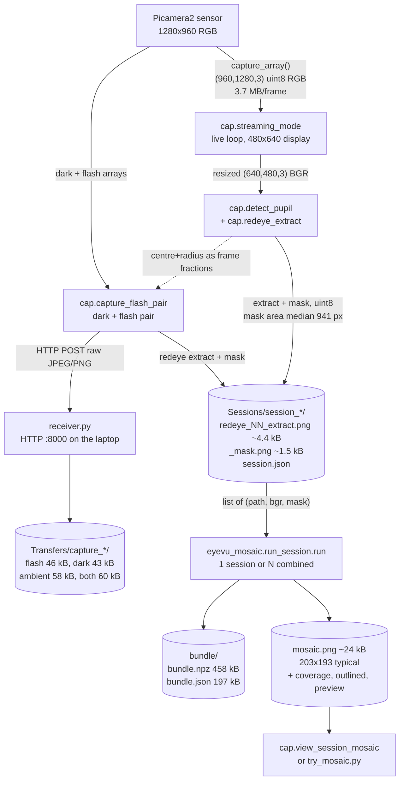

**What crosses each boundary.**

| Boundary | Payload | Format and size |
|---|---|---|
| sensor → live loop | one frame | `(960, 1280, 3)` uint8 RGB in memory, 3.69 MB; rotated by `LIVE_ROTATION=1` ([cap.py:175](../cap.py#L175)) |
| live loop → detection | display copy | resized to `DISPLAY_W=480 x DISPLAY_H=640` ([cap.py:5119-5120](../cap.py#L5119-L5120)) |
| detection → session | extract + mask | two PNGs per capture, median 4.4 kB and 1.5 kB |
| Pi → laptop | capture folder | HTTP POST to `192.168.137.1:8000` ([cap.py:139](../cap.py#L139)) |
| session → mosaic | patches | `load_sessions` returns `[(path, bgr, mask)]` ([run_session.py:116](../eyevu_mosaic/run_session.py#L116)) |
| mosaic → bundle | everything | `bundle.npz` 458 kB for 10 patches, `bundle.json` 197 kB |

**Two facts worth carrying into tuning.**

*Extracts arrive at two resolutions, sometimes in the same session.* Measured
across `Sessions/`:

| session | 640x480 | 1280x960 |
|---|---|---|
| `..._113948` | 11 | 2 |
| `..._115547` | 12 | 2 |
| `..._214652` | 38 | 2 |
| `..._223238` | 0 | 12 |
| `..._224337` | 0 | 10 |

The two `save_session_frame` call sites differ: [cap.py:5422](../cap.py#L5422)
passes a full-resolution mask (its comment says so), while
[cap.py:5546](../cap.py#L5546) passes the display-sized `meas["mask"]`. The two
newest sessions are uniformly full-resolution; I did not trace exactly when that
changed. `preprocess.analysis_scale` is what normalises the difference — see
Level 2c.

*The mosaic reads the session folder, not the capture folder.* `Transfers/` is a
diagnostic sink. Nothing in `eyevu_mosaic` ever opens it.

---

# Level 2 — subsystems

Dataflow, not call order. Parameter entry points are marked `⚙`.

## 2a — live pupil detection, `cap.detect_pupil`

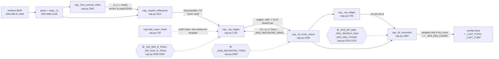

The recentring loop is the part to understand: the corneal reflex sits at the
pupil **edge**, so the first centre is wrong by roughly a pupil radius. Rays are
recast from each new circle centre until the centre stops moving by more than
2 px ([cap.py:2095](../cap.py#L2095)). A circle is fitted rather than an ellipse
because a circle is stable on a partial arc — the comment at
[cap.py:2071-2075](../cap.py#L2071-L2075) says the ellipse version "ran away into
the bright glow".

## 2b — red-eye extraction, `cap.redeye_extract`

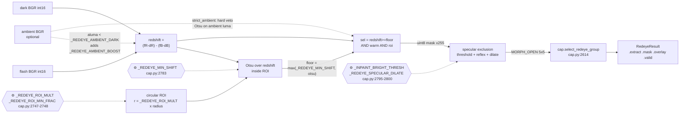

Both thresholds here are **adaptive with a fixed floor** — Otsu over the ROI, but
never below `_REDEYE_MIN_SHIFT`. Speculars are *excluded, not inpainted*
([cap.py:2793](../cap.py#L2793)), which is why `eyevu_mosaic`'s own
`specular_mask` usually finds nothing on real captures.

## 2c — mosaic preprocessing, `preprocess.prepare`

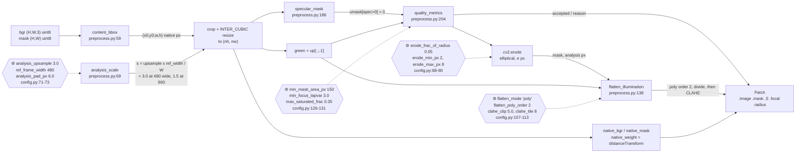

Two things to notice. `analysis_scale` depends on **frame width only**
([preprocess.py:75](../eyevu_mosaic/core/preprocess.py#L75)) — I verified this on
a real bundle: `native_bgr_0` is `(93,110,3)` and `img_0` is `(140,165)`, a factor
of 1.505, which is `3.0 x 480 / 960`. And the quality gate converts back to
**native** px before thresholding
([preprocess.py:220](../eyevu_mosaic/core/preprocess.py#L220)), so the area gate
does not silently rescale by `s²`.

## 2d — pairwise matching, `pairwise.match_pair`

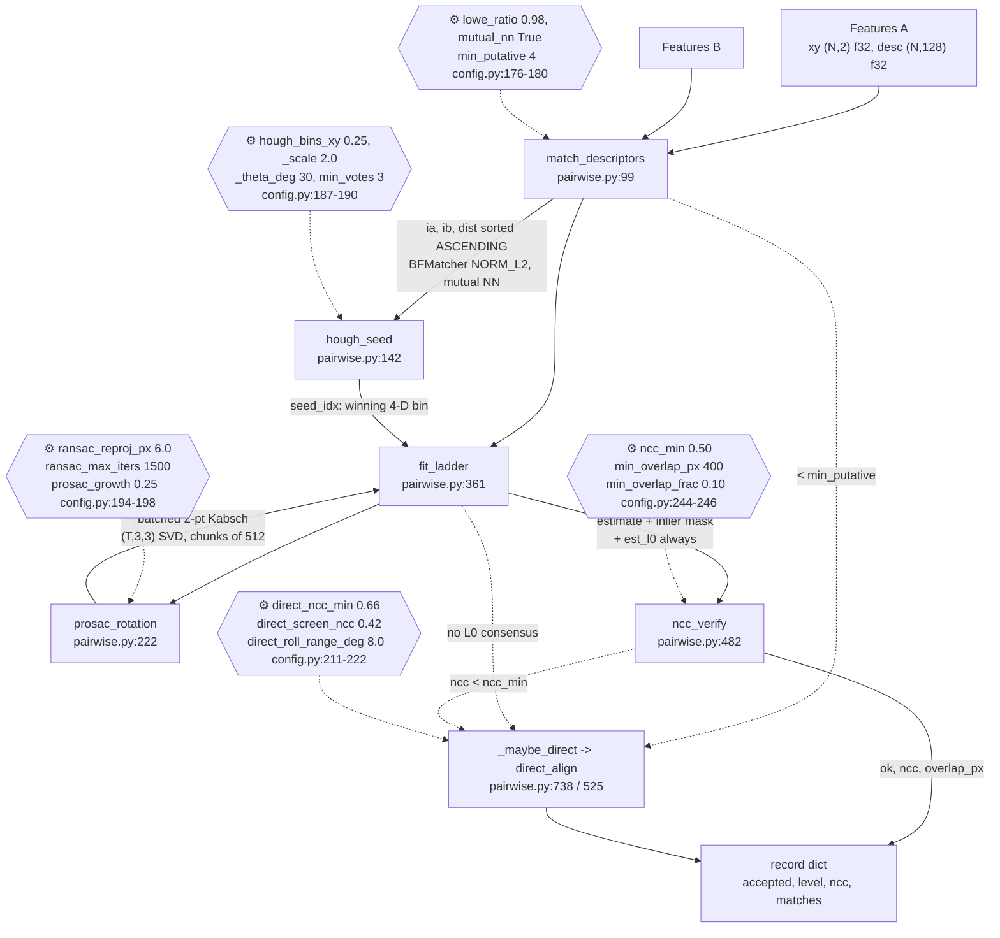

`ncc_verify` is the decisive gate — the inlier count is not. Note the three
separate routes into `_maybe_direct`: too few putatives, no L0 consensus, and a
failed photometric check. A direct edge carries `matches = None`, which is
exactly how `globalopt` later decides it needs an explicit rotation prior.

## 2e — graph and global optimisation

```mermaid
graph LR
  RECS["records[]<br/>accepted pairs"]
  BUILD["graph.build<br/>graph.py:40"]
  CYC["graph.cycle_filter<br/>graph.py:72"]
  COMP["graph.components<br/>graph.py:189"]
  MST["graph.max_spanning_tree<br/>graph.py:210"]
  INIT["graph.initial_rotations<br/>graph.py:231"]
  RA["globalopt.rotation_average<br/>iters=30"]
  BA["globalopt.bundle_adjust<br/>scipy least_squares"]
  REJ["globalopt._reject_outliers"]
  G["G: {patch -> 3x3 rotation}"]

  RECS --> BUILD
  BUILD -->|"edges both directions<br/>R = so3_exp(est_l0.rotvec)<br/>w = n_inliers x ncc / (1+resid)"| CYC
  CYC -->|"drops weakest edge of any<br/>triangle over threshold, one per pass"| COMP
  COMP -->|"components, largest first"| MST
  MST -->|"Kruskal on w"| INIT
  INIT -->|"G_j = G_i R_ij^T from highest-degree root"| RA
  RA --> BA
  BA -->|"3 params/patch, one fixed for gauge<br/>Huber, jac_sparsity"| REJ
  REJ -->|"drop worst, unless it is a bridge"| RA
  REJ --> G
  C1{{"⚙ cycle_max_error_px 18.0<br/>cycle_check True  config.py:264-265"}} -.-> CYC
  C2{{"⚙ ba_huber_delta 4.0, ba_max_iters 60<br/>ba_max_tracks 400  config.py:273-285"}} -.-> BA
  C3{{"⚙ global_outlier_max_px 25.0<br/>_max_drops 6, _rounds 2<br/>config.py:307-309"}} -.-> REJ
```

Cycle error is scored in **analysis pixels, not degrees**
([graph.py:183](../eyevu_mosaic/core/graph.py#L183)): pointing error is weighted
by the focal (~3600 px) and roll only by the patch radius (~70 px). The
solve/reject/re-solve order matters — rejection runs *after* the solve because
rotation averaging hides a bad edge by spreading its error
([globalopt.py:435-441](../eyevu_mosaic/core/globalopt.py#L435-L441)).

## 2f — compositing, `compose.composite`

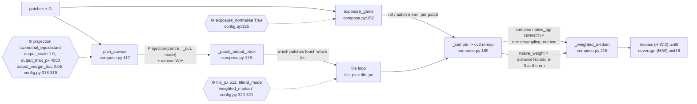

`_sample` remaps from `patch.native_bgr` — the **native crop**, not the analysis
image — so output pixels come from source pixels with one resampling
([compose.py:203](../eyevu_mosaic/core/compose.py#L203)). That is why
`analysis_upsample` affects matching accuracy but not output sharpness.

---

# Level 3 — sequence

## 3a — the live capture loop

The stage machine in `streaming_mode` ([cap.py:5070-5975](../cap.py#L5070-L5975)).
Stages come from `guidance` ([guidance.py:48-54](../guidance.py#L48-L54)).

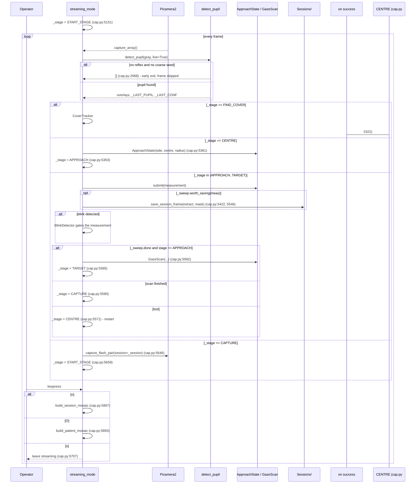

`capture_flash_pair` itself is strictly ordered because the pupil must dilate
([cap.py:4847-4923](../cap.py#L4847-L4923)):

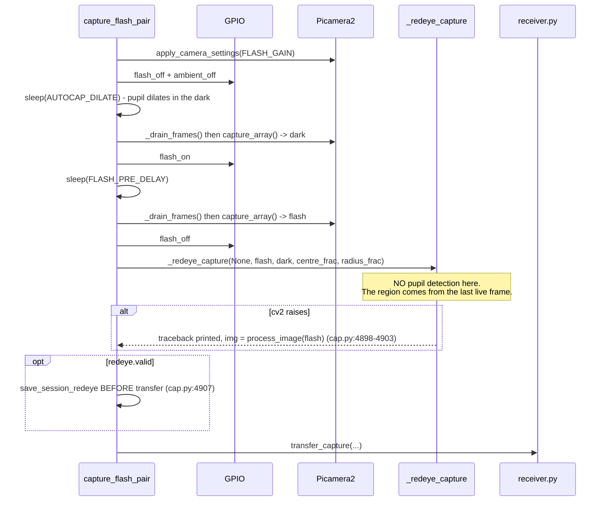

The `_drain_frames` calls are load-bearing: picamera2 buffers frames, so the
first array after an LED change can still be a stale exposure
([cap.py:163-167](../cap.py#L163-L167)).

## 3b — a full mosaicing run

`run_session.run` ([run_session.py:145](../eyevu_mosaic/run_session.py#L145)).
Every stage is inside one `try`, and the `finally` always writes a bundle.

```mermaid
sequenceDiagram
  participant C as caller
  participant R as run_session.run
  participant P as preprocess
  participant F as features
  participant M as pairwise
  participant G as graph
  participant O as globalopt
  participant X as compose
  participant B as bundle

  C->>R: run(dirs, out_dir, cfg)
  R->>R: load_sessions(dirs)
  alt no captures
    R-->>B: RuntimeError -> finally writes bundle with traceback
  end
  R->>P: prepare(i, img, mask, cfg) per capture
  P-->>R: Patch(accepted, reason)
  Note over R: rejected patches are logged,<br/>never silently dropped
  R->>F: detect(patch, cfg, SIFTDetector)
  F-->>R: Features
  R->>R: reject patches with < min_keypoints (run_session.py:227)
  alt fewer than 2 usable
    R-->>B: RuntimeError "need >= 2 usable captures"
  end
  R->>M: shortlist(good, cfg)
  loop each candidate pair
    R->>M: match_pair(...)
    alt feature path fails
      M->>M: _maybe_direct -> direct_align
      Note over M: needs scikit-image;<br/>absent -> (None, nan, 0), degrades
    end
    M-->>R: record (accepted or with a reason)
  end
  R->>G: build -> cycle_filter -> components
  alt no component survived
    R-->>B: RuntimeError "no pair survived verification"
  end
  loop each component
    R->>G: max_spanning_tree + initial_rotations
    R->>O: refine(...)
    Note over O: scipy absent -> BA skipped,<br/>rotation averaging only, recorded in bundle
    O-->>R: G, stats
  end
  R->>X: composite per component
  X-->>R: mosaic, coverage, projection, info
  opt more than one component
    R->>R: WARNING, write mosaic_component_N.png each
  end
  R->>B: write(everything + timings + error)
  alt bundle write itself fails
    B-->>C: prints "BUNDLE WRITE FAILED" + traceback (run_session.py:390)
  end
  R-->>C: {ok, out_dir, components, timings, error}
```

**Early exits and degradations, all of them.**

| Where | Condition | Result |
|---|---|---|
| [run_session.py:208](../eyevu_mosaic/run_session.py#L208) | no captures found | RuntimeError, bundle still written |
| [run_session.py:227](../eyevu_mosaic/run_session.py#L227) | `len(f) < min_keypoints` | patch rejected with reason |
| [run_session.py:240](../eyevu_mosaic/run_session.py#L240) | fewer than 2 usable patches | RuntimeError, bundle still written |
| [pairwise.py:553](../eyevu_mosaic/core/pairwise.py#L553) | scikit-image missing | direct alignment unavailable, `nan` recorded, feature path unaffected |
| [globalopt.py:471](../eyevu_mosaic/core/globalopt.py#L471) | `bundle_adjust` off, or scipy missing | falls back to rotation averaging, method recorded |
| [globalopt.py:473](../eyevu_mosaic/core/globalopt.py#L473) | more than half of edges above L1 | rotation averaging instead of BA |
| [run_session.py:281](../eyevu_mosaic/run_session.py#L281) | no component survived | RuntimeError, bundle still written |
| [run_session.py:352](../eyevu_mosaic/run_session.py#L352) | >1 component | separate mosaic each, warning; **no relative placement invented** |
| [run_session.py:368](../eyevu_mosaic/run_session.py#L368) | `fail_soft` False | re-raises after writing |
| [run_session.py:390](../eyevu_mosaic/run_session.py#L390) | bundle write fails | traceback to stdout, does not raise |

On the `cap.py` side there is one more layer: `build_session_mosaic` catches
`ImportError` and falls back to `mosaic.py`
([cap.py:4247-4249](../cap.py#L4247-L4249)), and catches any other exception and
falls back again ([cap.py:4256-4260](../cap.py#L4256-L4260)) — even though `run`
is already fail-soft. `build_patient_mosaic` has the ImportError branch but
**no** legacy fallback ([cap.py:4316-4319](../cap.py#L4316-L4319)); it returns
`(None, {})`.

---

# Call graph — generated

**Method.** `pyan3` (installed cleanly via `pip install pyan3`) run as:

```
python -m pyan eyevu_mosaic/core/*.py eyevu_mosaic/run_session.py \
       eyevu_mosaic/config.py --root . --uses --no-defines --dot
```

Its DOT output (235 edges, 159 nodes) was converted to Mermaid by a script that
keeps only function-level edges and drops module bookkeeping nodes. After
filtering: **139 functions, 201 call edges**.

**What it misses.** Stated so you know how far to trust it:

- **Dynamic dispatch.** `features.detect` takes a `detector` argument and calls
  `det.detect_and_describe` ([features.py:130](../eyevu_mosaic/core/features.py#L130)).
  pyan resolves this to `SIFTDetector` only because that is the sole
  implementation; a learned detector dropped in later would not appear.
- **Callbacks.** `composite(progress=...)` and the `residuals`/`unpack` closures
  passed to `scipy.optimize.least_squares` are edges pyan cannot follow into
  scipy and back.
- **Library calls are not shown at all.** Every `cv2.*`, `numpy.*` and `scipy.*`
  call is invisible here, which hides where the real work happens — `cv2.SIFT`,
  `cv2.warpPerspective`, `cv2.remap`, `scipy.optimize.least_squares`.
- **Lazy imports inside functions** (`from .models import make_K` at
  [preprocess.py:346](../eyevu_mosaic/core/preprocess.py#L346),
  `from skimage.registration import ...` at
  [pairwise.py:552](../eyevu_mosaic/core/pairwise.py#L552)) are resolved for the
  first-party case and simply absent for the third-party one.
- **`cap.py` is not included.** pyan choked on nothing, but at 5 459 lines with a
  882-line `streaming_mode` the result was unreadable; the Level 3 diagrams cover
  that path by hand instead, with line references.

## Module level

Edge labels are the number of distinct function-to-function call edges.

Node ids are suffixed `_m` because `graph` is a Mermaid keyword and cannot be a
node id.

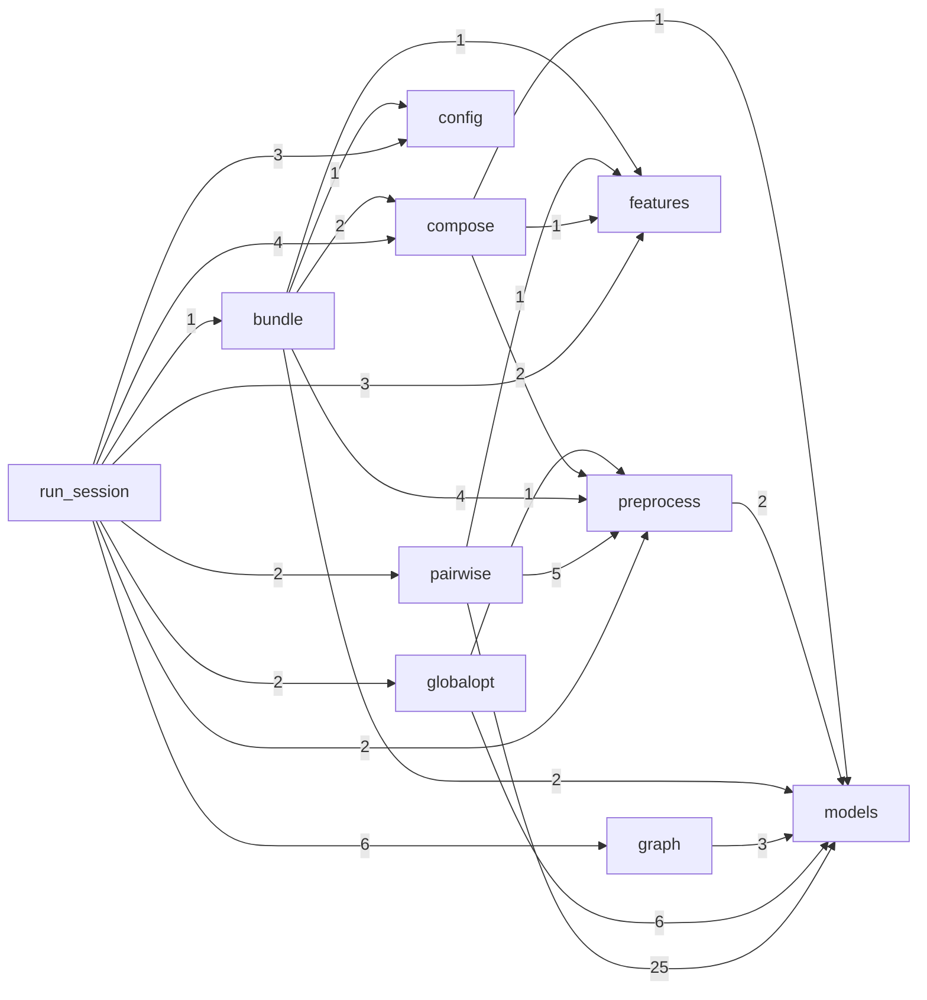

`models` is the sink: nothing in the package imports back into `pairwise` or
`run_session`. `preprocess` sits below almost everything because `patch_K` is
defined there rather than in `models`.

## The main path, function level

Only the edges `run_session.run` itself makes, in execution order.

```mermaid
graph TB
  RUN["run_session.run"]
  RUN --> LS["run_session.load_sessions"]
  RUN --> PREP["preprocess.prepare"]
  RUN --> SIFT["features.SIFTDetector"]
  RUN --> DET["features.detect"]
  RUN --> SL["pairwise.shortlist"]
  RUN --> MP["pairwise.match_pair"]
  RUN --> GB["graph.build"]
  RUN --> GC["graph.cycle_filter"]
  RUN --> GK["graph.components"]
  RUN --> GM["graph.max_spanning_tree"]
  RUN --> GI["graph.initial_rotations"]
  RUN --> RF["globalopt.refine"]
  RUN --> BT["globalopt.build_tracks"]
  RUN --> CP["compose.composite"]
  RUN --> PO["compose.patch_outlines"]
  RUN --> DO["compose.draw_outlines"]
  RUN --> BW["bundle.write"]
```

## Inside the two modules you will actually tune

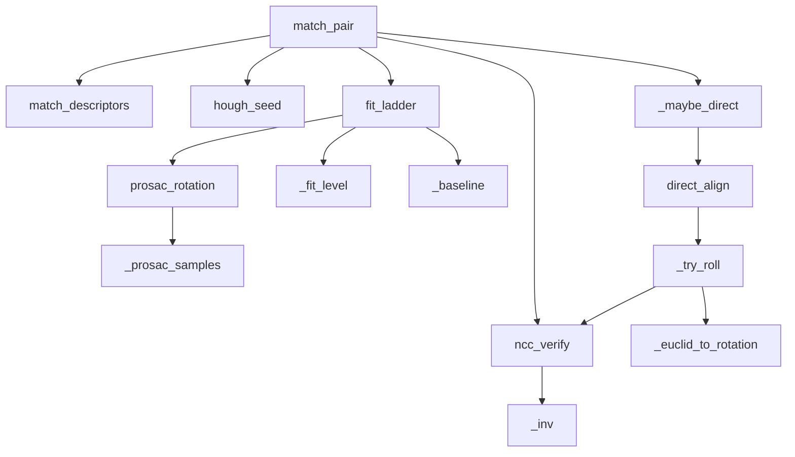

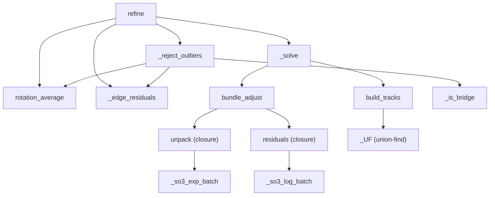

One thing the graph shows that the prose does not: `ncc_verify` is reached from
**two** places — the normal feature path via `match_pair`, and inside
`_try_roll`, once per roll hypothesis. That is why `direct_align` is the
expensive stage, and why `direct_screen_ncc` exists to cut the roll sweep short.

---

*Step 2 of 6. Next: `docs/PARAMETERS.md`.*
